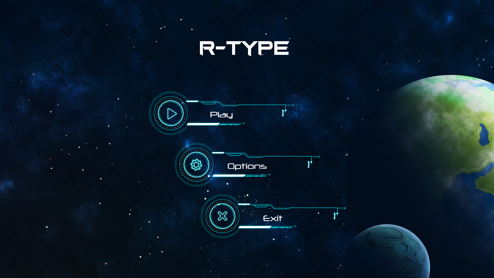
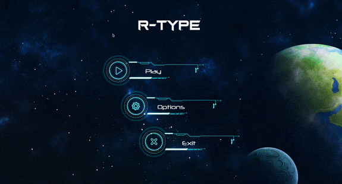

# Epitech - R-Type

  

The goal of this two week project was to create a R-Type like game and implement a multi room server for multiplayer.

The game is create with modularity in mind, the maps, mobs, attacks and mouvements are dynamics libraries. The architecture is an Entity Component System. It's compatible with Linux, Mac and Windows !

The game is not finished and miss functionalities.

## Libraries used:
  - SFML
  - Boost asio

  

